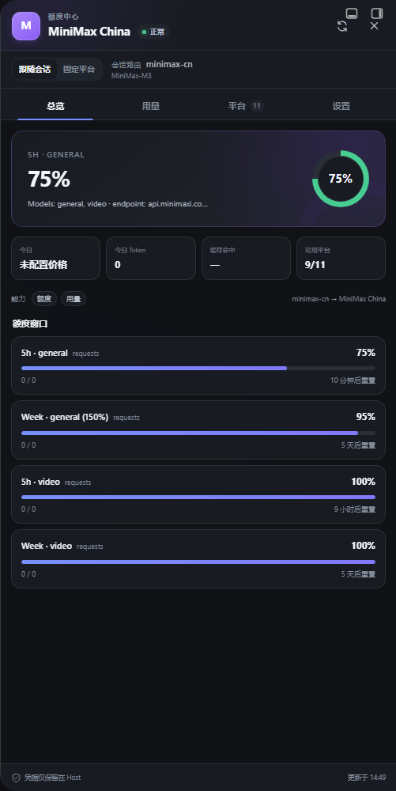

# dsh-quota

English | [简体中文](README.zh.md)

[](https://github.com/Lottle7/dsh-quota/actions/workflows/ci.yml)
[](https://github.com/Lottle7/dsh-quota/releases)
[](LICENSE)
[](https://github.com/deepseek-ai/deepseek-harness)

Multi-provider quota, balance, and Token-cost dashboard for **DeepSeek Harness (DSH) Web**.

`dsh-quota` follows the active DSH Session and distinguishes the model vendor from the route that actually bills it. If a Session runs a MiniMax model through OpenRouter, usage remains attributed to OpenRouter. It combines five native account integrations, six local-accounting routes, a draggable always-on widget, usage analytics, local model pricing, and safe route diagnostics.



## Install

Install the prebuilt release into the DSH Web profile, then restart DSH Web:

```bash
dsh plugin --profile web add "https://github.com/Lottle7/dsh-quota/releases/download/v0.5.1/dsh-quota.tgz"
dsh web
```

The prebuilt archive does not require a local TypeScript build. To install the tagged source instead, use the command below and follow pnpm's `allowBuilds` prompt if pnpm 10 or later asks for it:

```bash
dsh plugin --profile web add "github:Lottle7/dsh-quota#v0.5.1"
```

## Highlights

- Follows the active Session's route, model, reasoning effort, and official `tokenUsage` projection.
- Shows the provider's balance, quota windows, key spending limit, and provider-side usage when its API exposes them.
- Tracks current-Session, daily, and rolling 30-day Tokens and estimated CNY cost by billing platform and model.
- Keeps a draggable mini dashboard visible while you work; switch it to icon-only mode, hide it, or reset its position.
- Preserves per-Session Token baselines so reloads and model switches do not double-count usage.
- Displays a gap-free seven-day trend and a 30-day provider/model breakdown, with JSON export.
- Lets you edit per-model CNY-per-million-Token prices in the browser and restore Host defaults at any time.
- Explains route resolution, billing provider, model vendor, confidence, and cache state in a credential-free diagnostic report.
- Supports desktop drawers, a responsive mobile bottom sheet, light/dark themes, and Chinese/English UI copy.

## Supported platforms

Native account queries:

| Platform | What is displayed | Host credential |
|---|---|---|
| MiniMax China | Coding Plan quota windows | `MINIMAX_CN_API_KEY` or `MINIMAX_CN_COOKIE` |
| MiniMax International | Coding Plan quota windows | `MINIMAX_INTL_API_KEY` or `MINIMAX_INTL_COOKIE` |
| DeepSeek Official | Multi-currency account balance | `DEEPSEEK_API_KEY` |
| OpenRouter | Key usage, spending limit, remaining allowance, and reset cadence | `OPENROUTER_API_KEY` or `OPENROUTER_KEY` |
| SiliconFlow | Recharge, gifted, and total balance | `SILICONFLOW_API_KEY` or `SILICONFLOW_KEY` |

Local Token and cost accounting, without an additional provider credential:

| Platform | Route aliases |
|---|---|
| Moonshot / Kimi | `moonshot`, `kimi` |
| Zhipu GLM | `zhipu`, `bigmodel`, `glm` |
| Alibaba Bailian | `dashscope`, `bailian` |
| Volcengine Ark | `volcengine`, `ark`, `doubao` |
| Together AI | `together`, `together-ai` |
| Fireworks AI | `fireworks`, `fireworks-ai` |

Local-accounting integrations never invent a balance. They report only the Token projection supplied by DSH and the price table configured by the user.

## Interface

- **Overview** — active billing-platform balance/quota, today's Token cost and connection summary.
- **Usage** — Session, today and 30-day totals, seven-day chart, and provider/model rankings.
- **Providers** — inspect all 11 integrations or pin one for viewing without changing the Session model.
- **Settings** — control the floating widget, edit local prices, inspect route resolution, copy diagnostics, and export usage.

The floating widget's mode and position are browser-local. It temporarily yields while the full quota center is open and returns when the drawer closes.

## Configuration

The Host settings namespace is `dsh-quota`:

```yaml
dsh-quota:
  enabled: true
  refreshIntervalMs: 60000
  warningBalanceBelow: 10
  warningQuotaRemainingBelow: 0.2

  # Use an explicit mapping when a custom route name cannot be identified.
  routeMappings:
    my-company-openrouter: openrouter

  providerEnabled:
    minimax-cn: true
    minimax-intl: true
    deepseek-official: true
    openrouter: true
    siliconflow: true
    moonshot: true
    zhipu: true
    alibaba-bailian: true
    volcengine-ark: true
    together: true
    fireworks: true

  pricing:
    default:
      inputCacheHitPerMTokCNY: 0
      inputCacheMissPerMTokCNY: 0
      outputPerMTokCNY: 0
    overrides: {}
    peakHours:
      weekdays: []
      windows: []
      timezone: Asia/Shanghai
```

Prices are estimates only and never modify a provider bill. An empty `peakHours.windows` disables time-based discounts. Browser price overrides stay in `localStorage`, take precedence over the matching Host model price, and contain no credentials.

## Privacy and security

- API keys and cookies are resolved only through the DSH Host credential service.
- Credentials are not sent to the browser, stored in local usage history, or included in diagnostics.
- The browser stores only Token aggregates, UI preferences, and prices entered by the user; message content is not persisted.
- Host responses and persisted snapshots are recursively redacted.
- Write routes require JSON and validate Host, Origin, and `Sec-Fetch-Site`.
- Arbitrary custom URLs with bearer tokens are intentionally unsupported to avoid an SSRF and credential-exfiltration surface.

Please report security issues privately as described in [SECURITY.md](SECURITY.md).

## Compatibility

- Node.js 22 or later.
- DeepSeek Harness `0.1.x` Web profile.
- CI verifies Node.js 22 and 24 with type checking, unit tests, a client Loader smoke test, and package-content validation.

DSH is still evolving through release candidates. Run the Loader smoke test after upgrading DSH before deploying the plugin broadly.

## Update or remove

Install a newer prebuilt archive with the same `dsh plugin` command and its new version URL. To remove the bundle:

```bash
dsh plugin --profile web remove dsh-quota
```

Restart `dsh web` after adding, updating, or removing a bundle.

## Development

```bash
npm install
npm run test:ci
```

To link a local checkout into the Web profile, run this from the repository root:

```bash
dsh plugin --profile web add .
```

The package declares `cordis.patch.yml` as a DSH bundle. The patch mounts both the Host provider registry and the browser client. See [CONTRIBUTING.md](CONTRIBUTING.md) for adapter and pull-request guidance.

The prepared [DSH registry submission](docs/REGISTRY_SUBMISSION.md) records the marketplace entry, prebuilt tarball URL, screenshot, and required GitHub topics.

## License

[MIT](LICENSE)
